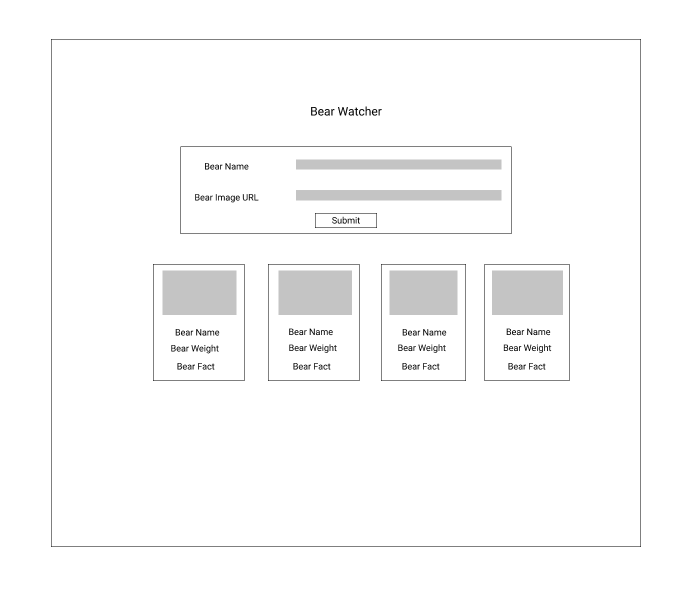

# Bear Watcher
## Overview
Bear Watcher is an app where the user can enter a bear name and image url. It then populates a card with the name, image, a random weight, and a random bear fact.
## Wireframe

## Deployed project
[Link to deployed site](https://lindseysatterfield-bear-watcher.netlify.app/)

## Project Board
[Bear Watcher project board](https://github.com/lindseysatterfield/ASSIGNMENT-Bear-Watcher/projects/1)
## Features
- form to grab user input, specifically with bear names and bear image url
- user gets to add their own images
- card dynamically added to the DOM with bear information
- randomized bear weight and fun facts added to bear cards
- responsive design
## Screenshots

## Contributors
[Lindsey Satterfield](https://github.com/lindseysatterfield)
## Loom walkthrough
[Link to Loom](https://www.loom.com/share/940553e25fc04c428220e415fe51d141)
